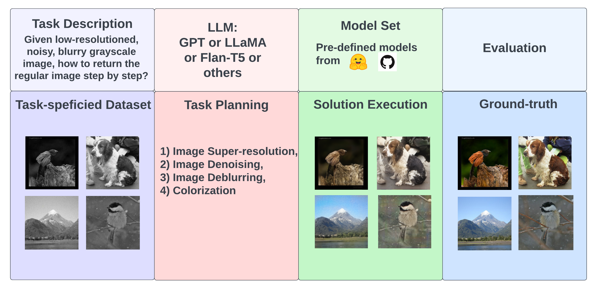

# OpenAGI: When LLM Meets Domain Experts

> "May the Force be with LLM and Domain Experts." -- Generated by ChatGPT



## Introduction
Human intelligence has the remarkable ability to assemble basic skills into complex ones so as to solve complex tasks. This ability is equally important for Artificial Intelligence (AI), and thus, we assert that in addition to the development of large, comprehensive intelligent models, it is equally crucial to equip such models with the capability to harness various domain-specific expert models for complex task-solving in the pursuit of Artificial General Intelligence (AGI). Recent developments in Large Language Models (LLMs) have demonstrated remarkable learning and reasoning abilities, making them promising as a controller to select, synthesize, and execute external models to solve complex tasks. 

This project presents OpenAGI, an open-source AGI research platform, specifically designed to offer complex, multi-step tasks and accompanied by task-specific datasets, evaluation metrics, and a diverse range of extensible models. OpenAGI formulates complex tasks as natural language queries, serving as input to the LLM. The LLM subsequently selects, synthesizes, and executes models provided by OpenAGI to address the task. Furthermore, the project presents the Reinforcement Learning from Task Feedback (RLTF) mechanism, which uses the task-solving result as feedback to improve the LLM's task-solving ability. Thus, the LLM is responsible for synthesizing various external models for solving complex tasks, while RLTF provides feedback to improve its task-solving ability, enabling a feedback loop for self-improving AI. We believe that the paradigm of LLMs operating various expert models for complex task-solving is a promising approach towards AGI. To facilitate the community's long-term improvement and evaluation of AGI's ability, we open-source the code, benchmark, and evaluation methods of the OpenAGI project, and we appreciate any discussions, comments, suggestions or contributions from the community.

## Requirements:
- Python 3.9.7
- PyTorch 1.10.1
- transformers 4.2.1
- tqdm
- numpy
- sentencepiece
- pyyaml


## Usage

0. Clone this repo

    ```
    git clone https://github.com/jeykigung/P5.git
    ```

1. Download preprocessed data from this [Google Drive link](https://drive.google.com/file/d/1qGxgmx7G_WB7JE4Cn_bEcZ_o_NAJLE3G/view?usp=sharing), then put them into the *data* folder. If you would like to preprocess your own data, please follow the jupyter notebooks in the *preprocess* folder. Raw data can be downloaded from this [Google Drive link](https://drive.google.com/file/d/1uE-_wpGmIiRLxaIy8wItMspOf5xRNF2O/view?usp=sharing), then put them into the *raw_data* folder.

   
2. Download pretrained checkpoints into *snap* folder. If you would like to train your own P5 models, *snap* folder will also be used to store P5 checkpoints.


3. Pretrain with scripts in *scripts* folder, such as

    ```
    bash scripts/pretrain_P5_base_beauty.sh 4
    ```
   Here *4* means using 4 GPUs to conduct parallel pretraining.
    
4. Evaluate with example jupyter notebooks in the *notebooks* folder. Before testing, create a soft link of *data* folder to the *notebooks* folder by
   
   ```
   cd notebooks
   ln -s ../data .
   ```


## Citation

```
@article{openagi,
  title={OpenAGI: When LLM Meets Domain Experts},
  author={Ge, Yingqiang and Hua, Wenyue and Ji, Jianchao and Tan, Juntao and Xu, Shuyuan and Zhang, Yongfeng},
  journal={arXiv},
  year={2023}
}
```

